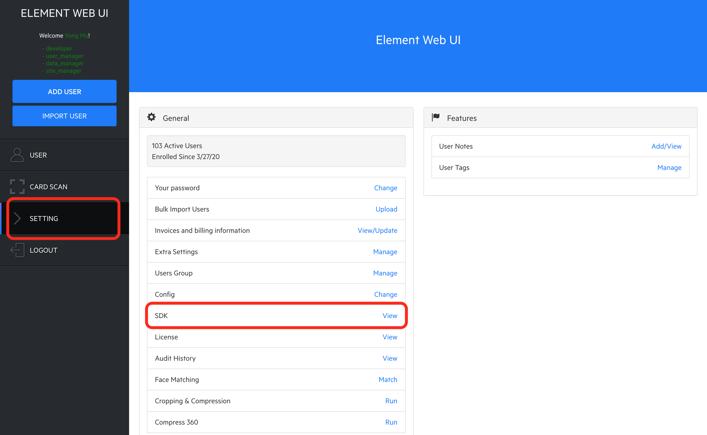
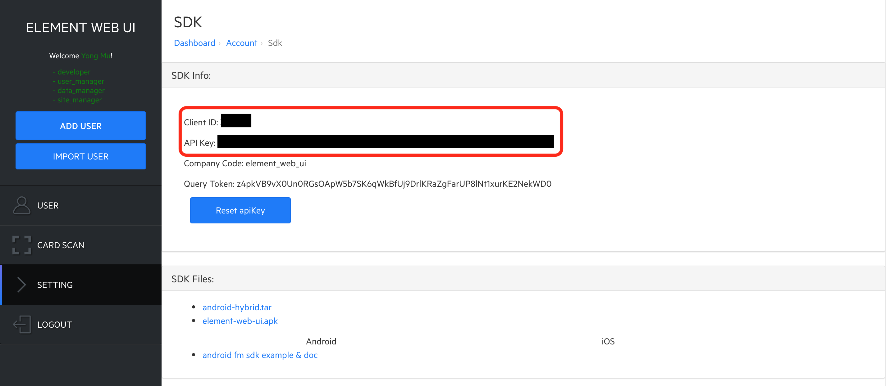

# Element Web UI (Android Hybrid Version)
The Element Web UI (Android Hybrid Version) provides an example to show how to do liveness check using webview. This document contains information to integrate the Element Web UI (Android Hybrid Version) into an Android application by using Android Studio.

## Version Support
### Android SDK & Android Studio
- The Element Web UI (Android Hybrid Version) requires Android 4.1+ / API 16+ (Jelly Bean and up)
- Android Target SDK Version 29, Build Tool Version 28.0.3, and AndroidX
- Android Studio 3.2.0 with Gradle Wrapper 4.6

### Dependencies
- AndroidX Appcompat: 1.1.0
- Google Gson: 2.8.6

Check the `dependencies` block in the [build.gradle](app/build.gradle) in the example project for more details.

## Prerequisites
### Element Dashboard
The Element Dashboard is the gateway to the assets in order to use the Element Web UI. The URL of the Element Dashboard varies based on your element backend setup. Also an account is required to access the Element Dashboard. Please contact [Element](#questions) for more information.

### Client ID and API Key
The Client ID and API Key will be used for Element Web UI app to communicate with element backend. Find them here:
1. Log into the Element Dashboard with your account.
1. Select `Setting` tab in the left navigation bar.
1. Find the menu item named `SDK`, click the `View` button next to it.

1. Under `SDK Info` section, you can see the Client ID and API Key.


## Setup with Android Studio
### Add the aar file
1. Open your project in Android Studio.
1. Obtain the latest version of element-web-ui-[VERSION].aar
1. Copy aar into target folder. In this sample, it's element-web-ui. It may vary depending on your project setting.

### Add dependencies
1. Add following dependencies into your app/build.gradle file:
    ```
        implementation project(':element-web-ui')
        implementation 'com.google.code.gson:gson:2.8.6'
        implementation 'androidx.appcompat:appcompat:1.1.0'
    ```
    Note that you might have already declared some of these dependencies in your `build.gradle` file, so please make sure you did not declare them twice. And you might also have to tweak a little bit on the versions of the dependencies as well as `compileSdkVersion` and `targetSdkVersion` in the `build.gradle`. Please follow the Android Studio's prompts on this. More information can be found [here](https://developer.android.com/studio/build/#module-level).
1. In gradle.properties, add the following lines to enable AndroidX support:
    ```
        android.useAndroidX=true
        android.enableJetifier=true
    ```
1. Wait for the Android Studio to sync.

### Update your AndroidManifest.xml
1. Add permissions
    ```
        <uses-permission android:name="android.permission.INTERNET" />
        <uses-permission android:name="android.permission.CAMERA" />
    ```
1. Add WebViewActivity
    ```
        <activity
            android:name=".WebViewActivity"
            android:theme="@android:style/Theme.NoTitleBar" />
    ```
1. Add this line in application section to execute the App.java first
    ```
        android:name=".App"
    ```

### Modify your MainActivity
Referring related part of sample app's MainActivity.java to update your MainActivity.java. Notice to use your resources like buttons and edittexts to replace the ones in the sample app.

### Config backend connection
Declare Client ID, API Key, and URL in gradle.properties

    ```
        ELEMENT_CLIENT_ID=xxx
        ELEMENT_API_KEY=xxxxxxxxxxxxxxxxxxxxxxxxxxxxxxxxxxxxx
        ELEMENT_SERVER_URL=https://sample.discoverelement.com
    ```

Also add following lines into defaultConfig in build.gradle on the app level :

    ```
        buildConfigField "String", "ELEMENT_API_KEY", "\"${ELEMENT_API_KEY}\""
        buildConfigField "String", "ELEMENT_CLIENT_ID", "\"${ELEMENT_CLIENT_ID}\""
        buildConfigField "String", "ELEMENT_SERVER_URL", "\"${ELEMENT_SERVER_URL}\""
    ```

Or you can use other methods preferred to pass the keys to ElementApiImplement.init() method in App.java.

Your connection maybe different from the sample assumed. Under this case, you may need refer to App.java and ElementApiImplement.java to implement your own connection methods.

## Run Your App
By now you can run or debug your app as usual.

## UI Customizations
You can change the stencil and dot in camera page. To replace them, add your own files into app/src/main/assets/images folder (you might need to create one if the folder does not exist).

The dot is a gif file, named corner_dot.gif.

The stencil has two SVG files, one is stencil_in.svg, shown when face in the stencil; another is stencil_notin.svg, shown when face not in stencil.

### Questions?
If you have questions, please contact devsupport@discoverelement.com.
